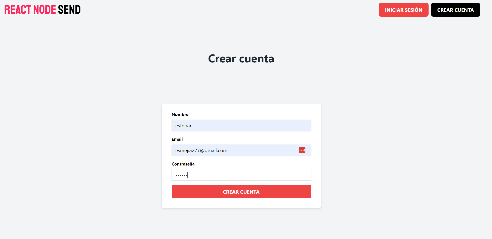
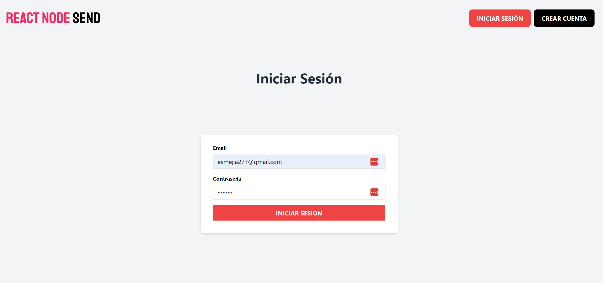
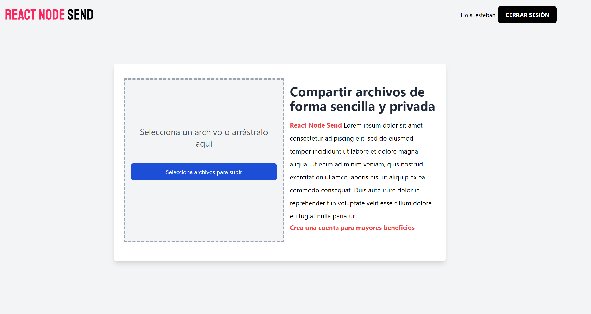
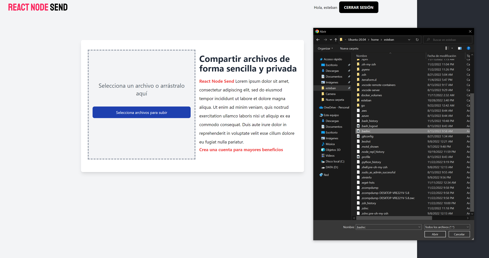
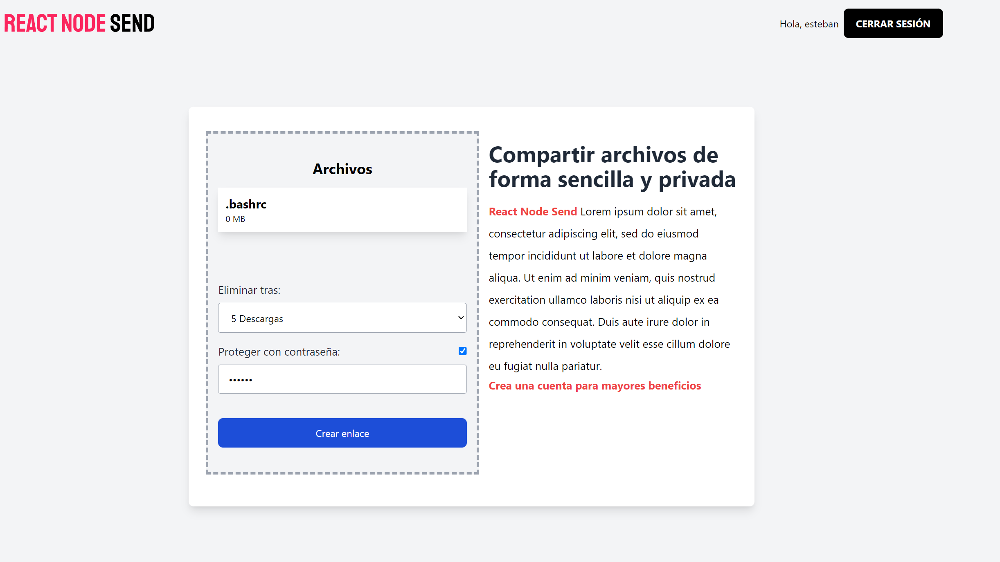

# node-send

This is a web application to upload and share files with others

Built with MERN stack (Mongo, Express, React, Node technologies)

1. Clone this project

    `git clone git@github.com:esmejia277/node-send.git`

2. Provide a mongodb instance
   
    We will provide a docker container as a mondodb instance
    
    a. Install docker [docker documentation](https://docs.docker.com/)

    b. Create a mongodb container based on [the official docker image](https://hub.docker.com/_/mongo)
 
    `docker run --name mongodb -v 
     $HOME/docker_volumes/mongo:/data/db -p 27017:27017 -d mongo`

3. Export environment variables
    
    Be careful with these values, they are considered sensitive data since they contains the database credentials,
    json web token secret.

    Go to the working directory and modify the next files

    `nodesend-server/vars.env:`
    
       DB_URL=mongodb://localhost:27017
       FRONTEND_URL=http://localhost:3000
       SECRET_KEY=top-secret

4. Start the `nodesend-client` and `nodesend-server`

    `nodesend-client`
     
       npm run install
       npm run dev (for development purposes)
       npm run build && npm run start (for production purposes)

    `nodesend-server`
     
       npm run install
       npm run dev   (for development purposes)
       npm run start (for production purposes)

5. You will see the user interface

    
    
    

    
    
    

    